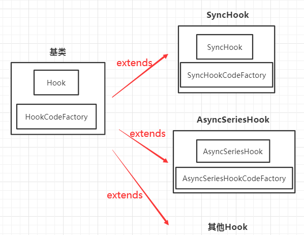

# tapable

类似EventListener，用于发布订阅事件，模仿[tapable(v2.2.0)](https://github.com/webpack/tapable)<br>
用于webpack实现plugin体系

|方法|执行方式|备注|
|-|-|-|
|SyncHook|同步串行|-|
|SyncBailHook|同步串行|返回值不是`undefined`，跳过后续tap执行并返回|
|SyncWaterfallHook|同步串行|上一个tap返回值传给下一个tap|
|SyncLoopHook|同步循环|返回值不是`undefined`，循环。多个taps时返回不是`undefined`，从第一个tap重新循环|
|AsyncParallelHook|异步并发|-|
|AsyncParallelBailHook|异步并发|返回值不是`undefined`，跳过后续tap执行并返回|
|AsyncSeriesHook|异步串行|-|
|AsyncSeriesLoopHook|异步循环|返回值不是`undefined`，循环。多个taps时返回不是`undefined`，从第一个tap重新循环|
|AsyncSeriesBailHook|异步串行|返回值不是`undefined`，跳过后续tap执行并返回|
|AsyncSeriesWaterfallHook|异步串行|上一个tap返回值传给下一个tap|

## 方法
如上表格，tapable支持若干方法，主要区别为：
* 同步(`Sync`) / 异步(`Async`)
* 串行(`Series`) / 并发(`Parallel`)
* 上一个的输出做下一个的输入(`Waterfall`) / tap返回值异常停止后续执行(`Bail`) / 不关心返回值

拦截器：包含四个方法<br>
* register：注册时触发，可以修改tap函数<br>
* call：执行call方法时触发的钩子<br>
* tap：执行每个tap时触发的钩子<br>
* loop：执行循环时触发的钩子<br>

## 安装
```bash
yarn add @copyist/tapable
```

## 使用
* 同步执行

```js
const hook = new SyncHook(['arg1']);
hook.tap('tap1', (arg1) => {
  console.log('tap1执行：', arg1);
})
hook.tap('tap2', (arg1) => {
  console.log('tap2执行：', arg1);
})
hook.call('1');
// 输出：
// tap1执行： 1
// tap2执行： 1
```

* 异步执行
```js
const hook = new AsyncSeriesHook(['arg1']);
hook.tapAsync('tap1', (arg1, cb) => {
  console.log('tap执行：', arg1);
  cb();
})
hook.callAsync('1', () => {
  console.log('done')
});
hook.promise('2').then(() => {
  console.log('promise done')
})
// 输出：
// tap执行： 1
// done
// tap执行： 2
// promise done
```

## 解析：实现两个基类Hook、HookCodeFactory

### Hook：注册tap事件、intercept拦截器

1、实现tap注册，tap队列有优先级，可以插队

* 用stage表示优先级，默认为0，越小越优先<br>
* 用before表示插入到哪个前面

因为插入是按序的，所以调整顺序时使用插入排序
```js
// 实现tap方法，并用stage表示优先级
class Hook {
  constructor() {
    this.taps = [];
  }

  /** 处理参数*/
  _dealOption(option){
    if(typeof option === 'string') {
      option = {
        name: option,
      }
    }
    return option;
  }
  /* 插入tap*/
  tap(option, fn){
    option = this._dealOption(option);
    option.fn = fn;
    const stage = option.stage || 0;
   
    let i = this.taps.length;
    /** 插入排序，stage字段判断是否向前 */
    while (i > 0) {
      const tap = this.taps[i - 1];
      this.taps[i] = tap;
      const tState = tap.stage || 0;
      /** stage小就往前排 */
      if (stage < tState) {
        i--;
        continue;
      }
      break;
    }
    this.taps[i] = option;
  }
}
```
测试
```js
const hook = new Hook();
hook.tap('a',()=>{});
hook.tap({name:'b',stage: -1},()=>{})
console.log(hook.taps)
// 输出：
// {name: 'b', stage: -1, fn: [Function]}
// {name: 'a', fn: [Function]}
```
```js
// 修改tap方法，添加before插队
tap(option, fn){
  option = this._dealOption(option);
  option.fn = fn;
  const stage = option.stage || 0;
  let before = new Set();
  if (typeof option.before === 'string') {
    before = new Set([option.before]);
  } else if (Array.isArray(option.before)) {
    before = new Set(option.before);
  }
  let i = this.taps.length;
  /** 插入排序，stage和before字段判断是否向前 */
  while (i > 0) {
    const tap = this.taps[i - 1];
    this.taps[i] = tap;
    const tState = tap.stage || 0;
    if (stage < tState) {
      i--;
      continue;
    }
    if (before.size) {
      before.delete(tap.name);
      i--;
      continue;
    }
    break;
  }
  this.taps[i] = option;
}
```
测试
```js
const hook = new Hook();
hook.tap('a',()=>{});
hook.tap({name:'b',before: ['a']},()=>{})
console.log(hook.taps)
// 输出：
// {name: 'b', before: ['a'], fn: [Function]}
// {name: 'a', fn: [Function]}
```
2、实现interceptor注册<br>
register：注册时触发，可以修改tap函数<br>
```js
// 添加intercept方法
intercept(option){
  // 构造函数需添加 this.interceptors = [];
  this.interceptors.push(option);
  if (option.register) {
    for (let i = 0; i < this.taps.length; i++) {
      // 修改tap
      this.taps[i] = this.interceptors[i].register(this.taps[i]);
    }
  }
}
```
测试
```js
const hook = new Hook();
hook.tap('a',()=>{});
hook.intercept({
  register: tap => {
    tap.fn = () => {
      console.log('修改过的tap..')
    }
    return tap;
  }
})
console.log(hook.taps[0].fn());
// 输出：修改过的tap..
```
interceptor中的其他三个方法：call、tap和loop是执行时的钩子，是HookCodeFactory中的一部分
### HookCodeFactory：构造可执行的代码
实现call、callAsync和promise等方法，生成一个Function再执行

看Hook类里面的代码
```js
class Hook{
  /** _createCall得到一个Function */
  call = () => {
    this.call = hookCodeFactory._createCall("sync");
    return this.call(...args);
  };
}
```
1、第一次调用call方法时，会根据参数生成一个new Function<br>
2、再次调用call方法，不用再次生成而是直接拿上次的Function执行。<br>
3、为什么这样可以翻到下面的[tapable相关问题]<br>

_createCall中包含tap函数和拦截器函数的执行，思路如下:<br>
1、定义好各个变量<br>
2、执行call的钩子函数<br>
3、分别执行taps，先执行tap钩子函数，再执行tap<br>
```js
class HookCodeFactory {
  _createCall(type = 'sync'){
    // 1、定义变量
    let code = `
      var _taps = this.taps;
      var _x = _taps.map(tap => tap.fn);
      var _interceptors = this.interceptors;
    `
    // 2、执行拦截器call钩子函数
    // code += interceptorsCall();
  
    const _interceptorsTaps = this.interceptors.map(_ => _.tap).filter(Boolean);
  
    // 3、依次执行taps，先执行tap钩子再执行tap
    code += `
      const _interceptorsTaps = _interceptors.map(_ => _.tap).filter(Boolean);
      _taps.forEach((tap, tIdx) => {
        ${_interceptorsTaps.map((_tap, idx) => `_interceptorsTaps[${idx}](tap)`).join(';')}
        _x[tIdx]();
      })
    `;
    return new Function('', code);
  }
}
```
测试
```js
const hook = new Hook();
hook.tap('a', () => { console.log('执行...') });
hook.call()
// 输出：执行...
```

可以通过下面方法看到生成的Function代码
```js
const hook = new Hook();
hook.tap('a', () => {});
hook.call();
console.log(hook.call.toString());  // 输出生成的call函数
```

## 实现各种Hook
上面的例子，实现了一个简单的同步Hook，但要实现不同的Hook，需要改造，如图<br>

* 将公共方法放在基类，实现类的不同方法在继承时重写

### 注册事件的tap、tapAsync和tapPromise方法
tap是一个事件，自然就有同步和异步之分，所以有这三个注册方法<br>
不是所有Hook都有这三种注册方式，同步的Hook不能注册异步tap，因为同步Hook需要同步执行完事件<br>
```js
// 同步事件
hook.tap('sync', () => {
  console.log('注册sync tap')
});
// async事件
hook.tapAsync('async', (cb) => {
  console.log('注册async tap');
  cb();
});
// tapPromise事件
hook.tapPromise('tapPromise', () => {
  return new Promise((resolve) => {
    console.log('注册promise tap');
    resolve();
  })
});
```

### 执行事件的call、callAsync、promise
执行事件也同步和异步，所以也有三种<br>
不是所有Hook都有这三种执行方式，异步Hook不能调用call，因为注册了异步的事件，执行也肯定需要异步完成。<br>
```js
// 同步执行
hook.call();
// async执行
hook.callAsync('async', () => {
  console.log('async执行完的回调');
});
// promise执行
hook.promise('promise').then(() => {
  console.log('promise执行完事件')
});
```
### 举例1、SyncBailHook
方法特性：同步串行，tap返回值不是`undefined`则跳过后续tap执行并返回<br>
注册用的是tap，不能用tapAsync或tapPromise<br>
执行事件可以是call、callAsync或promise<br>
要实现的功能：
```js
hook.tap('tap1', () => {
  console.log('tap1...');
});
hook.intercept({
  tap: () => {},
  call: () => {},
});
hook.call();
```

需要执行的代码：<br>
* 调用拦截器的call方法
* 调用拦截器的tap方法
* 调用同步的tap方法

构造的函数大致如下：
```js
function anonymous(){
  // 1、定义变量
  var _taps = this.taps;
  var _x = _taps.map(tap => tap.fn);
  var _interceptors = this.interceptors;
  // 2、执行call钩子函数
  _interceptors.forEach(interceptor => {
    if (interceptor.call) {
      interceptor.call();
    }
  })
  // 3、依次执行taps
  const _interceptorsTaps = this.interceptors.map(_ => _.tap).filter(Boolean);
  let result;
  for(let i=0;i<_taps.length;i++){
    _interceptorsTaps.map((_interceptorsTap, idx) => {
      // 3.1 先执行tap拦截器函数
        _interceptorsTaps[idx](tap);
      }
      // 3.2 再执行tap函数
      result = _x[tIdx]();
      if (result !== undefined) {
        // 4、tap返回值不是undefined，不再往下执行
        return;
      }
  }
}
```
1、如果将`hook.call()`换成`hook.callAsync(()=>{})`<br>
* `anonymous`函数添加一个`callback`参数，执行时传入
```js
callAsync(...args){
  this.callAsync = hookCodeFactory._createCall();
  this.callAsync(...args); // 将参数传入
}
```
* 上面的第4点`return`改为
```js
if (result !== undefined) {
  callback();
}
```
2、如果将`hook.call()`换成`hook.promise().then(...)`<br>
* 执行taps的部分要变成`return new Promise()`
* 上面的第4点`return`改为
```js
if (result !== undefined) {
  resolve();
}
```


### 举例2、AsyncSeriesHook
异步串行<br>
注册用的是tap、tapAsync或tapPromise<br>
执行事件可以是callAsync或promise，不能用call<br>
要实现的功能：
```js
hook.tapAsync('tap1', (cb) => {
  console.log('tap1...');
  cb();
});
hook.tapAsync('tap2', (cb) => {
  console.log('tap2...');
  cb();
});
hook.intercept({
  tap: () => {},
  call: () => {},
})
hook.callAsync();
```

需要执行的代码：<br>
* 调用拦截器的call方法
* 调用拦截器的tap方法
* 调用异步的tap方法

需要依次执行每个异步方法，所以将每个tap用函数包裹，一个执行完再执行下一个<br>
有点类似于中间件<br>
构造的函数大致如下：
```js
function anonymous(callback){
  // 1、定义变量
  var _taps = this.taps;
  var _x = _taps.map(tap => tap.fn);
  var _interceptors = this.interceptors;
  // 2、执行call钩子函数
  _interceptors.forEach(interceptor => {
    if (interceptor.call) {
      interceptor.call();
    }
  })
  // 3、依次执行taps
  const _interceptorsTaps = this.interceptors.map(_ => _.tap).filter(Boolean);
  function next0(){
    function done(){
      typeof next1 !== 'undefined' ? next1() : callback();
    }
    // 3.1 先执行tap拦截器函数
      _interceptorsTaps[0](tap);
    // 3.2 再执行tap函数
    _x[0](done);
  };
  function next1(){
    function done(){
      typeof next2 !== 'undefined' ? next2() : callback();
    }
    // 3.1 先执行tap拦截器函数
      _interceptorsTaps[1](tap);
    // 3.2 再执行tap函数
    _x[1](done);
  }
  next0();
}
```
1、如果将`tapAsync`改为`tapPromise`，则<br>
* 3.2执行tap函数改为` _x[0]().then(() => done());`<br>
* `callback()`部分改成`resolve()`<br>

### 举例3、AsyncParallelHook
异步并发<br>
注册用的是tap、tapAsync或tapPromise<br>
执行事件可以是callAsync或promise，不能用call<br>
要实现的功能：
```js
hook.tapAsync('tap1', (cb) => {
  console.log('tap1...');
  cb();
});
hook.tapPromise('tap2', () => {
  return Promise(resolve=>{
    console.log('tap2...');
    resolve();
  })
});
hook.intercept({
  tap: () => {},
  call: () => {},
});
await hook.promise();
```

需要执行的代码：<br>
* 调用拦截器的call方法
* 调用拦截器的tap方法
* 调用异步的tap方法
* 统计是否执行完，是则完成
```js
function anonymous(callback){
  // 1、定义变量
  var _taps = this.taps;
  var _x = _taps.map(tap => tap.fn);
  var _interceptors = this.interceptors;
  // 2、执行call钩子函数
  _interceptors.forEach(interceptor => {
    if (interceptor.call) {
      interceptor.call();
    }
  })
  // 3、依次执行taps
  const _interceptorsTaps = this.interceptors.map(_ => _.tap).filter(Boolean);
  // 需要执行的tap数量
  let count = _x.length;
  function done(){
    if (--count <= 0) {
      resolve();
    }
  }
  // 3.1 先执行tap拦截器函数
  _interceptorsTaps[0](tap);
  // 3.2 再执行tap函数
  _x[0](done);
  // 3.1 先执行tap拦截器函数
  _interceptorsTaps[1](tap);
  // 3.2 再执行tap函数
  _x[1]().then(done);
}
```

### 规律
* 根据tap不同方法，构造不同的tap执行函数。
  * tap方法同步调用
  * tapAsync方法需要传入`done`函数（判断执行下一个还是结束）
  * tapPromise需要在`then`中处理`done`（判断执行下一个还是结束）
* 根据call不同方法，使用不同函数体。
  * call方法同步调用，依次执行tap
  * callAsync需要依次调用tap，执行完调用`callback`
  * promise需要返回`promise`，taps执行完再`resolve`

```js
// ①参数
function anonymous(args){
// ②变量

// ③拦截器call方法

// ④执行taps主体 
{
  // ⑤拦截器tap方法

  // ⑥执行tap

  // ⑦判断tap执行结果
}
// ⑧执行完taps
}

```
|步骤|call|callAsync|promise|
|--|--|--|--|
|①|-|有`callback`参数|-|
|④|-|-|返回`new Promise`|
|⑥|-|传入`done`函数|`then`中调用`done`|
|⑦|-|判断是否有下一个`next`函数，没有则`callback`结束|判断是否有下一个`next`函数，没有则`callback`结束|

|步骤|tap|tapAsync|tapPromise|
|-|-|-|-|
|⑥|-|调用`cb`结束tap|返回`promise`，`resolve()`结束tap|


## tapable相关问题
1、为什么用new Function而不是直接依次执行代码？<br>
* 执行过call后可以缓存call方法，不必再执行判断逻辑，效率更高
* 这个库是用于webpack plugin的，plugin需要重复调用
* issue [Why HookCodeFactory generated code](https://github.com/webpack/tapable/issues/114)
* issue [Query regarding coding paradigm used in this library](https://github.com/webpack/tapable/issues/62)

2、constructor中的this.tap = this.tap作用？
* 性能优化 [issue](https://github.com/webpack/tapable/issues/113)

3、为什么没有untap方法
* 也是性能问题 [issue](https://github.com/webpack/tapable/issues/71#issuecomment-419377713)

## 总结

* 文章是写完后再总结的，代码都是伪代码
* 虽然是仿照的，但具体实现还是有些不一样，前面写Sync*Hook的基本一样，写到后面看了它的API和测试用例就直接自己写了，所以会有差异
* 没有做异常处理
* 每个hook都有测试用例，拷贝了部分tapable的测试用例，其中使用HookTester的部分没有拷贝
* 如果有错，欢迎指出

## 参考
* [webpack4.0源码分析之Tapable](https://juejin.cn/post/6844903588112629767)
* [Webpack tapable 使用研究](https://juejin.cn/post/6844903895584473096)
* [webpack系列之二Tapable](https://juejin.cn/post/6844903750729990152)
